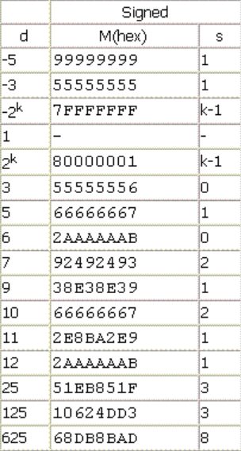

# 代码优化

`FinalCycle = DIV * 100 + MULT * 3 + JUMP/BRANCH * 1.5 + MEM * 2.5 + OTHER * 1`

1. 寄存器分配
2. 函数内联
3. 窥孔优化
4. 循环跳转
5. 乘除优化

## 后悔

强烈建议先划分基本块，然后再针对基本块生成目标代码，


## bugs

1. print %ret, ret 无法在symbol table中找到

2. print这个函数本身也是会改变%ret的，因为MIPS调用的关系

3. 乘除法优化，想省一条bne指令，就div两个数，结果第二个不能是常数，垃圾MARS

    只有被除数非常数时，mars才会做检查

4. 从basic block划分function block时，没有考虑到空函数，他只有一个basic block，而我划分时i++了，导致下一个函数也被划分到了这个空函数了。

5. function call, 修改全局变量，我把修改的所有变量都算进去了，这样适得其反，因为递归函数本身就修改自己的变量

6. 在find pattern时，找到了一个被移除的成空的node

7. 忘记写arr_load的逻辑，虽然和getint一样

8. function的modified symbolS, 如果函数有print行为，也要把ret加到modified symbols

9. getint不能删除，否则影响顺序

10. 有些优化后加，导致直接copy，导致bug

    比如arr_load和arrsave

    ```cpp
    int id = get_symbol_node_require_new(src2);
    std::string re_src2 = nodes[id].GetSymbolName();
    std::string re_src1 = nodes[id].GetSymbolName();
    return {op, dst, re_src1, re_src2};
    ```

    

11. 


## 架构

codes：每一条四元式

basic_block: 四元式进行划分，然后copy一份给自己

func_block: basic_block 的 id


1. 窥孔优化后，再划分基本块，此时原来的code和block里的是一样的
2. 在DAG以后，block里面的code就变了，所有要把block里的code倒腾回codes
3. 


## 寄存器分配

大坑是基本块

我LRU写错了，应该是接口设计混乱，没有分清楚搜索什么时候kick out，什么时候move

LRU：查找时，若命中，则移动到列表的尾部，不中，则弹出头部的元素，将新的元素移动到尾部（这个地方我有bug）

删除时，直接移除头部元素

temp寄存器有时候用完可以直接删了，没必要回写

使用LRU作为寄存器的分配策略，对于每一条四元式，可以这样思考寄存器和内存之间的关系：

reg：

reg对应的数据结构是一个table和一个order

1. 什么也不做，none
2. 将一个symbol放到reg里，put
3. 将一个symbol从reg中踢出去，remove

memo：

1. 什么也不做，none
2. 将reg中的symbol写入到memo中，save
3. 将memo中的symbol写入到reg中，load

将他们排列组合，得到有意义的操作：

1. reg-none+memo_save
2. reg-put+memo_none
3. reg-put+memo_load
4. reg-remove+memo_none
5. reg-remove+memo_save

这五种操作都不需要对order进行修改，修改应该是更高抽象需要考虑的

然后我们针对四元式做需求分析：

### arith

比如add一类的指令，分两种情况：

1. dst和src完全不相同：那么，dst不需要从memo中读取，直接操作2，reg_put+memo_none，

    然后src，若在寄存器中，需要调整order，否则需要从memo中读取，再调整order

2. dst和src有相同，检查dst是否在寄存器中，若在，则直接返回，否则，put+load

归纳出两种操作：

assign_reg_require_load_from_memo

1. 检查是否在寄存器中，在直接返回
2. 若不在，从memo中读取到寄存器中，可能要踢出寄存器

assign_reg_without_load_from_memo

1. 检查是否在寄存器中，在直接返回
2. 若不在，直接放到寄存器中，不需要读取，可能要踢出寄存器

### temp

临时变量有个特点，就是用完了，如果不在基本块中再使用，就可以直接扔掉，不用回写。


get：

在不在无所谓，我需要symbol出现。

1. 如果本身就在，那么需要调整order

2. 如果本身不在，分临时和局部/全局考虑

    使用关键词assign

3. 

require load from memo


assign：保证symbol不在regs中


## 函数内联

嵌套函数的内联，解决方法，先内联一层，然后再内联


```cpp
int print(int num) {
    if (num > 0) printf("num: %d\n", a);
    return 0;
}

int sum2(int a, int b) {
    return a + b;
}

int sum3(int a, int b, int c) {
    return sum2(sum2(a,b),c);
}

int main() {
    int a = 1, b = 5, c;
    a = sum2(a,b);
    print(a);
    c = sum3(a,b,b);
    print(c);
    return 0;
}
```


```cpp
int print(int num) {
    if (num > 0) printf("num: %d\n", num);
    return 0;
}

int print_arr(int a[], int n) {
    int i = 0;
    while (i < n) {
        print(a[i]);
        i = i+1;
    }
    return 0;
}

int sum_arr(int a[], int n) {
    int i = 0, sum = 0;
    while (i < n) {
            sum = sum + a[i];
            i = i+1;
    }
    return sum;
}

int main() {
    int a = 1, b = 5;
    int c[3] = {1,2,3};
    print(sum_arr(c,3));
    return 0;
}
```


```cpp
int g_a = 1;

void print(int a) {
    printf("%d\n", a);
}

int sum(int a, int b) {
    return a+b;
}
int main() {
    int a=1,b = 2;
    int c; // cout var
    c = sum(a,b);
    print(c);
    c = sum(a,b);
    print(c);
    return 0;
}
```

```cpp
int print(int num) {
    printf("num: %d\n", num);
    return 0;
}

int sum2(int a, int b) {
    return a + b;
}

int sum3(int a, int b, int c) {
    return sum2(a, sum2(b,c));
}

int sum4(int a, int b, int c, int d) {
    return sum2(sum3(a,b,c),d);
}

int main() {
    int a = 1;
    a = sum4(a, a, a, a);
    print(a);
    return 0;
}
```


## 窥孔优化

优化完了，可以改符号表，删除无用符号

快了1/4到1/50分之一

1. 无用label删除，为数据流做准备
2. 临时遍历删除
3. 自赋值删除，包括加减乘除
4. 赋值形式统一化，为DAG做准备


## 循环跳转

写出了一个没考虑continue的bug


## 乘除优化

这一块非常繁琐。很容易晕。难就难在有符号和无符号还有溢出上。

把除数分情况讨论：

### 2的幂次

有运算`div res, dividend, 2^k`

2的幂次的除法，如果被除数是正数，直接右移，即`sra res, dividend, k`

否则，加上一个偏移量，再右移，即

```asm
add res, dividend, 2^k-1
sra res, res, k
```

### 特殊的数

化简为一条乘法运算，两条移位运算和一条减法。

有运算`div res, dividend, divisor`

根据下表，找到divisor对应的magic_number和s，进行化简。



```asm
mult dividend, magic_number
mfhi res
sra res, res, s
bgtz d, 0, res_label
add res, res, 1
res_label:
```

需要注意，有的magic_number过大，如7，那么面对这种情况，就不优化。

### 参考资料

[负数除以2的幂次，需要加上偏移量](https://www.jianshu.com/p/8cf8732f2140)

[编译器如何将除法转换为对应的乘法](http://www.cppblog.com/huyutian/articles/124742.html)

分享一个样例

```cpp
int main() {
	int a = 25;
	printf(" 25 / 4 = %d\n", a/4);
	printf(" 25 mod 4 = %d\n", a%4);
	printf("-25 / 4 = %d\n", -a/4);
	printf("-25 mod 4 = %d\n", -a%4);
	a = 4;
	printf(" 4 / 4 = %d\n", a/4);
	printf(" 4 mod 4 = %d\n", a%4);
	printf("-4 / 4 = %d\n", -a/4);
	printf("-4 mod 4 = %d\n", -a%4);
	
	a = 7;
	printf(" 7 / 3 = %d\n", a/3);
	printf(" 7 mod 3 = %d\n", a%3);
	printf("-7 / 3 = %d\n", -a/3);
	printf("-7 mod 3 = %d\n", -a%3);
	
	a = 3;
	printf(" 3 / 3 = %d\n", a/3);
	printf(" 3 mod 3 = %d\n", a%3);
	printf("-3 / 3 = %d\n", -a/3);
	printf("-3 mod 3 = %d\n", -a%3);
	return 0;
}
```


## 划分基本块

Func_Begin: new block, add self

func_end: add-self

Label: if no codes, add to block, else new and add-self

Jump, bne, beq: add-self, new block

ret: if no codes, add-self, else new block then add-self

```json
label_codes: {
    FuncBegin, Label
},
jb_codes: {
    Func_End, Jump, BNE, BEQ
}
```


```
Func_Begin
Label
Label
	codes
	
Func_End / JUMP / BNE / BEQ
```

add func: contains label

add func: is_funcend

## 公共表达式提取+复写传播

DAG会导致更加频繁的访存操作，导致负优化


## 死代码删除


关键是函数的def和use。


我们不用考虑数组。

在一个函数callee内部，不可能修改掉caller中arr_load出到变量的值。

>进行死代码删除的时候，如果一条语句**没有副作用**，而且它的赋值目标(如果有的话)不在$out_S$中，那么这条语句就可以删去
>
>- 
>
>    所谓的副作用，其实就是除了"改变赋值目标变量"之外，其他所有的作用。显然，tac中没有既没有副作用，同时也没有赋值目标的语句
>
>- 
>
>    你在实现的时候可以认为除了`a = call b`之外的所有有赋值目标的语句都是没有副作用的，对于`a = call b`，如果$a\notin out_S$​​​，要求将它优化为`call b`

副作用：不是全局变量

反向迭代遇到call，要视作一个整体，因为函数调用被抽象为`global_symbol = `
