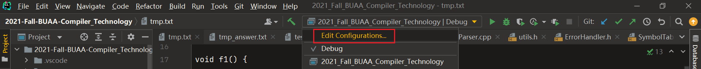

# 上机准备

chrome将下载路径修改为D盘，否则默认下载路径没有写入权限。

gitlab可以下载

## 上传与打开

### 上传

要上传的有`CMakeLists.txt, *.h, *.cpp, *.txt`

注意，

1. `CMakeLists.txt`可以上传，不过要注意其中的版本号，应当与机房所需一致。可以手动修改版本号。
2. 直接将`testfile.txt`等文本文档一起上传，这样本地测试的时候就不用新建了。提交时测评机会忽略这些文件。

### 打开

解压zip到文件夹，然后右键`open folder as cLion project`即可。

或者，`file -> open`，选择文件夹即可。

可能开打后，会让配置下cpp的编译路径啥的，直接默认即可。

## cLion配置

### 字体

file->settings->搜索font

字体大小14，line-height为1.2

### 工作路径

`Working directory`改成当前文件夹，不然默认读取是在debug目录下，读取不到。

## 坑

/r的时候行号不要+1就/n+1就好了